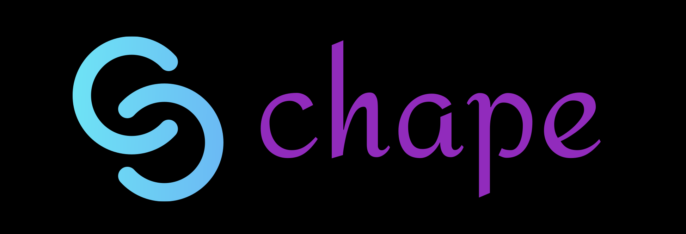

  

<b>Chape</b> is a dating application, made for alternative of Tinder in Telegram bot.
 
General features:

* **User friendly**: More simple interface with more features
* **Stable and fast**: It gives more stable and fast responses

Last thing I have to mention is the project is open source for learning, 
not for using as face of "Chape". 
And I will make new updates, new features to keep project on.